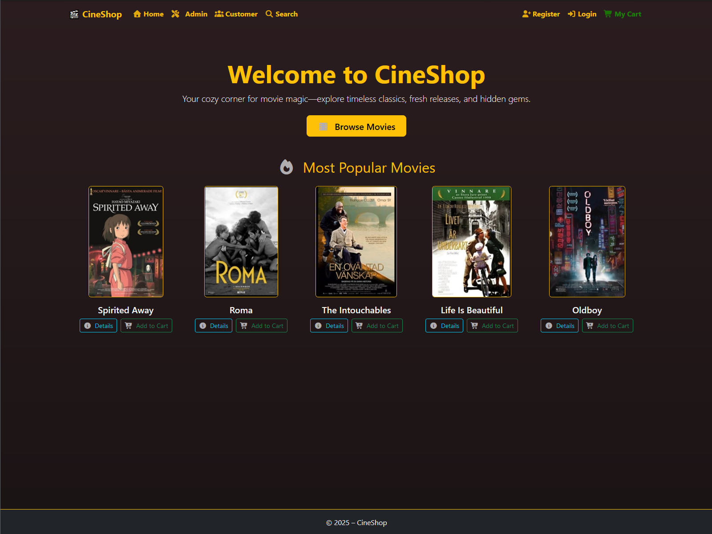
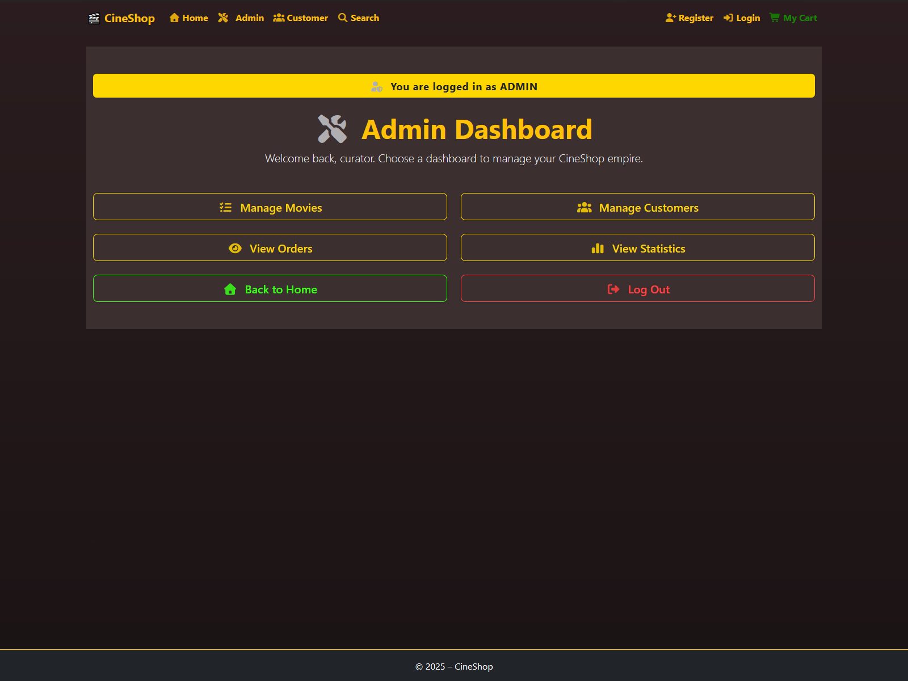

# CineShop
_A school project for the **Lexicon .NET Training Program (2025)**_

_Last updated: 2025-12-18_

**This repository is a sanitized personal copy maintained for portfolio purposes.**  

CineShop is an ASP.NET Core MVC movie store built as a school group project (team of 3).  
It demonstrates an end-to-end webshop flow: browsing movies, adding to cart, checkout/order creation, customer order history, and an admin view for managing data.

## Features

### Customer
- Browse movies (uses partial views for reusable UI)
- Movie details page
- Add/remove items in the shopping cart (supports multiple copies)
- Checkout creates an order for a customer (existing or newly registered)
- View order history for a customer

### Admin
- Admin dashboard
- View orders (newest to oldest)
- Manage movies (create/edit/delete)
- Manage customers (create/edit/delete)
- View order details

### Statistics / Home page
- Home page highlights such as “Most Popular Movies”
- Additional statistics views (e.g., newest/oldest/cheapest)

## Screenshots

### Frontend

### Admin Panel

## Tech Stack
- **.NET 8 / ASP.NET Core MVC**
- **Entity Framework Core (Code First + Migrations)**
- **SQL Server / LocalDB** (development)
- **Bootstrap + SCSS + JavaScript**

## Getting Started

### Prerequisites
- Visual Studio 2022
- .NET 8 SDK
- SQL Server / LocalDB

### Setup
1. Clone the repository
2. Configure the connection string in `appsettings.Development.json`
3. Apply migrations:
   - Package Manager Console: `Update-Database`
   - or CLI: `dotnet ef database update`
4. Run the project:
   - `dotnet run`
   - or start from Visual Studio

### Database Seeding
On first run, the app seeds initial **Customers**, **Movies**, and sample **Orders/OrderRows**.

## Demo Admin Login (training setup)
Admin login is implemented as a hardcoded check in `LoginController` for training/demo purposes.

- **Username:** `CineSharp`
- **Password:** `Sharp123`

## Project Structure
- `Controllers/` MVC controllers (Admin, Movies, Cart, Orders, etc.)
- `Models/` Domain models (Movie, Customer, Order, OrderRow, etc.)
- `DataBase/` EF Core DbContext
- `Services/` Business logic/services
- `Views/` Razor views + partials
- `wwwroot/` Static assets (CSS/SCSS, JS, images, libraries)

## Routes (examples)
- `/` Home / statistics
- `/Movies` Browse movies
- `/Cart` Shopping cart
- `/Orders/CustomerOrders` Customer order history
- `/Admin` Admin dashboard

## Contributors
- **PollyPinkPro** (@PollyPinkPro)
- **Philip** (@philip0000000)
- **ezgikara58** (@ezgikara58)

## Known Limitations / Improvements
- Replace hardcoded admin login with real auth (hashed password + policies/filters)
- Add validation attributes and stricter EF constraints (required fields, lengths, etc.)
- Improve search and pagination UX
- Add authorization filters/policies for all admin endpoints

